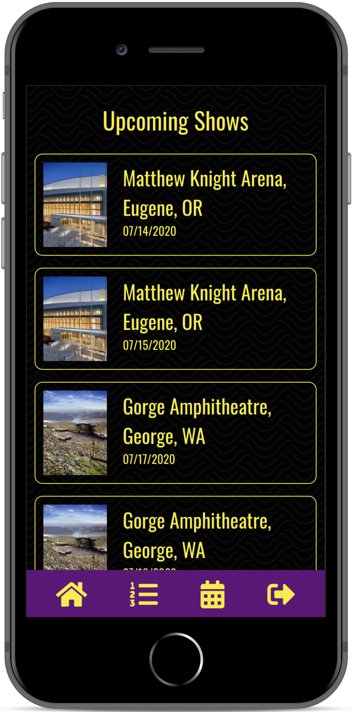
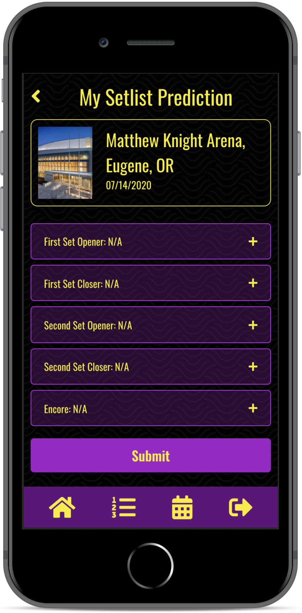
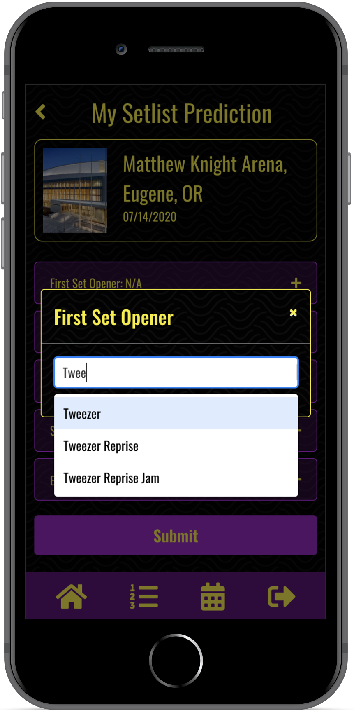

# Fantasy Fishbowl

## Overview

Fantasy Fishbowl is a work in progress fantasy sports-style app designed for mobile; instead of predicting sports performance, players attempt to predict which songs Vermont rock band Phish will play in concert.

This repo comprises the TypeScript/React.js frontend for the app; you can view the Rails 5 API backend repo [here](https://github.com/NB28VT/fantasy-fishbowl-rails5API).

Fantasy Fishbowl is an ongoing personal project built by [Nathan Burgess](https://nb28vt.github.io/).

## Current Technical Features/Toolchain
* [Mobx]("https://mobx.js.org/README.html/") for synchronizing application state
* [React Router]("https://reacttraining.com/react-router/") for page navigation
* [React Context]("https://reactjs.org/docs/context.html") for wrapping authenticated and unauthenticated versions of the app

  
  

