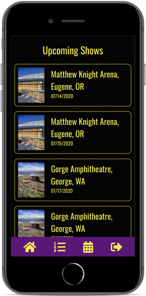
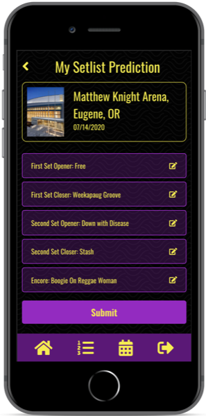

# Fantasy Fishbowl

## Overview

Fantasy Fishbowl is a work in progress fantasy sports-style app designed for mobile; instead of predicting sports performance, players attempt to predict which songs Vermont rock band Phish will play in concert.

This repo comprises the TypeScript/React.js frontend for the app; you can view the Rails 5 API backend repo [here](https://github.com/NB28VT/fantasy-fishbowl-rails5API).

Fantasy Fishbowl is an ongoing personal project built by [Nathan Burgess](https://nb28vt.github.io/).

## Current Technical Features/Toolchain
* [Mobx](https://github.com/mobxjs/mobx/tree/main/packages/mobx-react) for synchronizing application state
* [React Router](https://reacttraining.com/react-router/) for page navigation
* [React Context](https://reactjs.org/docs/context.html) for wrapping authenticated and unauthenticated versions of the app

<p float="left">

  
  
</p>

---

## Development Environment

The React client is designed to consume the headless Rails API [in this repo](https://github.com/NB28VT/fantasy-fishbowl-rails5API) on port 3001.

To run both at the same time, start the Rails app on port 3001 instead of the default 3000 (where the React client runs):
```
bundle exec rails s -p 3001
```

And then start the React client in this repo in a separate terminal window:
```
npm start
```
---

## Architecture

The app is split into two top-level components, [unauthenticatedAppMain](https://github.com/NB28VT/fantasy-fishbowl-typescript-client/blob/master/src/components/UnauthenticatedApp/unauthenticatedAppMain.tsx), where the login page and login callbacks live, and [authenticatedAppMain](https://github.com/NB28VT/fantasy-fishbowl-typescript-client/blob/master/src/components/authenticatedAppMain.tsx), where the bulk of the app exists for logged in users.

### Authentication

Fantasy Fishbowl's authentication is token-based; login tokens are saved to cookies via the [Universal Cookie](https://github.com/reactivestack/cookies/tree/master/packages/universal-cookie) NPM package. Tokens are returned from the `/authenticate` API endpoint when a valid email/password are submitted.

A valid token is required by the API to be submitted alongside POST and PATCH requests and is available in all Authenticated App components via a [React Context](https://reactjs.org/docs/context.html) called `AuthContext`.

### Application State

Application state is generally managed via the [MobX React library](https://github.com/mobxjs/mobx/tree/main/packages/mobx-react), which uses the `@observer` and `@observable` decorators (decorators are still an experimental feature of JavaScript and TypeScript classes as of January 2023 and specifically enabled here in `tsconfig.json` per [TypeScript's documentation](https://www.typescriptlang.org/docs/handbook/decorators.html)). See the MobX React documentation for more information on the observer decorator.

### Navigation

Page navigation in Fantasy Fishbowl is implemented using [React Router](https://github.com/remix-run/react-router#readme); you can see the declared routes for the logged in app in [authenticatedAppMain](https://github.com/NB28VT/fantasy-fishbowl-typescript-client/blob/master/src/components/authenticatedAppMain.tsx).

### Styling

For convenience, two high-level [flexbox](https://css-tricks.com/snippets/css/a-guide-to-flexbox/) wrapper components, `VerticalStack` and `HorizontalStack` are provided in [`src/utils/styles.tsx`](https://github.com/NB28VT/fantasy-fishbowl-typescript-client/blob/master/src/utils/styles.tsx) for content that flexes in columns and rows, respectively. 